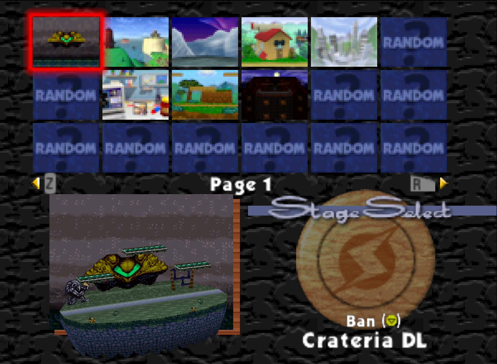

# Smash Remix KC Edition
A mod of Smash Remix Debugged that makes it easier to run tourneys with the KC Remix Ruleset.



# How to Play Online on RMG Kaillera Edition
- Find the `mupen64plus.ini` file
  - For portable installation, it will be under the `Data` folder wherever you set up RMG-K
  - For regular installation, it will be somewhere like `C:\Users\<USERNAME>\AppData\Local\Programs\RMG-K\Data`, substituting the username and possibly the drive
- Open the file with Notepad
- At the bottom, paste the following RDB info:

```
[11B4E57B7D7A7790A3BFB15942213702]
GoodName=SmashRemix KC 0.1.1
CRC=8F09381 B4C7C039
RefMD5=5AAC6E652C5CF1E37A466AC0073E88CA
CountPerOp=1
```

# Applying the Patch via Website
Assuming you already have the .xdelta

- Go to https://kotcrab.github.io/xdelta-wasm/
- For "source file", choose your vanilla legally dumped ROM
- For "patch file", choose the .xdelta file you downloaded
- It will download a patched ROM for you
- Recommended to rename that ROM to something that makes sense

# KC Remix Ruleset

- Characters
  - Top 4 (Pika/Kirby/Falcon/Yoshi) are banned
  - All regular Remix characters are legal
  - Bonus characters allowed: DSamus, Lucas, Peppy, Lanky, Dr. Luigi, Roy
  - Regional variants of unbanned vanilla characters are legal
  - Other d-pad characters ("boss characters" and polygons) are banned
- Format
  - 8 minutes
  - 4 stock
  - Tournament mode on
  - No gameplay or graphics altering menu options/CSS debug options allowed
  - Pausing the game is prohibited and may be considered a forfeiture at TO's discretion.  Hold to pause is ON.
    - A player may pause to quit out of a game and change stage/character/color/etc if such a change was missed, assuming they are following the "Order" rules below, as long as neither character has lost a stock and both players are at 0%.  If that is not true, the match may be considered a forfeiture at TO's discretion.
- Stages
  - Starters
    - Crateria DL
    - Melrode
    - Glacial River Remix
    - Planet Clancer, movement ON
    - Saffron DL, movement ON
  - Counterpicks
    - Dr. Mario
    - Goomba Road
    - Big Boo's Haunt, movement ON
- Order
  - Game 1
    - Both players choose their character blindly
    - Players RPS
    - Winner bans 1 starter
    - Loser bans 2 starters
    - Winner chooses from remaining starters
  - Remaining games
    - Winner bans 2  (press C down to ban) from starters + counterpicks
    - Loser picks a stage from remaining starters + counterpicks
      - mDSR applies -- a player cannot counterpick to the last stage they won on during the set
      - At any time during the set though, players may go to any _legal_ stage if both players agree to it
    - The winner chooses their character
    - The loser counterpicks their character

# List of changes from Smash Remix Debugged upstream
- Updated version message on title screen
- Updated tourney stage list to only 1 page, and to reflect our ruleset
- Updated random stages in tourney mode to reflect our ruleset
- Added new random music profile "yaron's Mix"
- Toggle updates (note: TE = tourney, CE = community, NE = netplay)
  - "Hold to exit training" default to ON in CE/NE modes
  - "Improved combo meter" default to ON in TE mode
  - "Tech chase combo meter" default to ON in TE mode
  - "Combo meter" default to ON in TE mode
  - "Hold to pause" default to ON in CE mode
  - "Menu music" default to "RANDOM ALL" in CE/NE modes, "Random Menu" in TE
  - "Show music title on round start" default to ON in TE mode
  - "Random music" default to ON in TE mode

# TODOs
- 0.2.0
  - Make Big Boo's Haunt a bit lighter
  - Adjust BBH moving plat timings so the plats aren't out for as long
  - Lighten up BBH stage icon
  - Add new random character select toggle "Tournament".  Removes banned characters, adds legal bonus characters.  Possibly uses the "best" region variant for legal vanilla characters if there's a clear choice
  - Add new toggle for CSS menu "Tournament" that removes only the banned options
  - Change tourney profile to use these new toggles
  - Update CSS menu toggle to reset all settings that are not available in the chosen option (example if you select "Tournament" and someone has taunt items enabled, it gets reset to off)
- Other
  - "Tourney mode" CSS toggle
  - Second page of stages in tourney mode for doubles
  - Update (neutral) spawns for any legal doubles stages
  - Add third page to stage select in tourney mode with stages that are borderline/we want more data on
  - Add labels to stage select pages in tourney mode
  - More random music profiles
  - Toggle to remove barrels in Smashketball 1

# Changelog
- 0.1.1
  - Updated tourney stage list to reflect v2 of the KC ruleset
  - Updated tourney random stages list to match v2 of KC ruleset
  - Fixed an issue where vanilla Dream Land was still included in tourney random stages
  - Updated random music profile "yaron's Mix"
- 0.1.0
  - Updated tourney stage list to only 1 page, and to reflect our ruleset
  - Updated random stages in tourney mode to reflect our ruleset
  - Added new random music profile "yaron's Mix"
  - Toggle updates (note: TE = tourney, CE = community, NE = netplay)
    - "Hold to exit training" default to ON in CE/NE modes
    - "Improved combo meter" default to ON in TE mode
    - "Tech chase combo meter" default to ON in TE mode
    - "Combo meter" default to ON in TE mode
    - "Hold to pause" default to ON in CE mode
    - "Menu music" default to "RANDOM ALL" in CE/NE modes, "Random Menu" in TE
    - "Show music title on round start" default to ON in TE mode
    - "Random music" default to ON in TE mode

# Credits
## Smash Remix Debugged Credits

Brob2nd: Leader of the project, programmer/coder.

Krix08: Co-leader of the project, programmer/coder, Creator of Extended VS Stats, Z Cancel Guide and Cruel Z-Cancel's Swap Music option.

MetaSSB / Meta Nais: Programmer, helper with programming.

Jilly Jane: Instrument Design, Project Galleon's Piano and Overdriven/Distortion Guitar Fix.

Halofactory: Creator of the Tap Jump option.

FASTLIKERAT: Creator of the Stage Bans feature.

kathy: Creator of the Walljump gameplay option.

MrMarioBros222: Fixer of the Sandbag 1P Modes crashes and animations changes.

MichaelthemanX: Sandbag's Announcer.

Loogi, Krix08 and Arrowshoes: Sandbag's Crowd Chant.

## Smash Remix
*A Super Smash Bros. 64 Mod Organized by The_Smashfather*

## Building
### THIS IS ONLY FOR THOSE INTERESTED IN THE SOURCE CODE OF THE MOD. PLEASE DOWNLOAD THE RELEASE VERSION BY CLICKING THE RELEASE TAB.
The original xdelta will generate a smash rom that is compatible with our ASM code. Much of our edits are done within
the compressed files within the rom. If you utilize a vanilla Smash 64 rom, it will not work correctly.

You must utilize the xdelta patch to generate a good rom for Assembly.

You must place your legally acquired patched ROM in the 'roms' folder for this to work. It must be named ssb.rom
